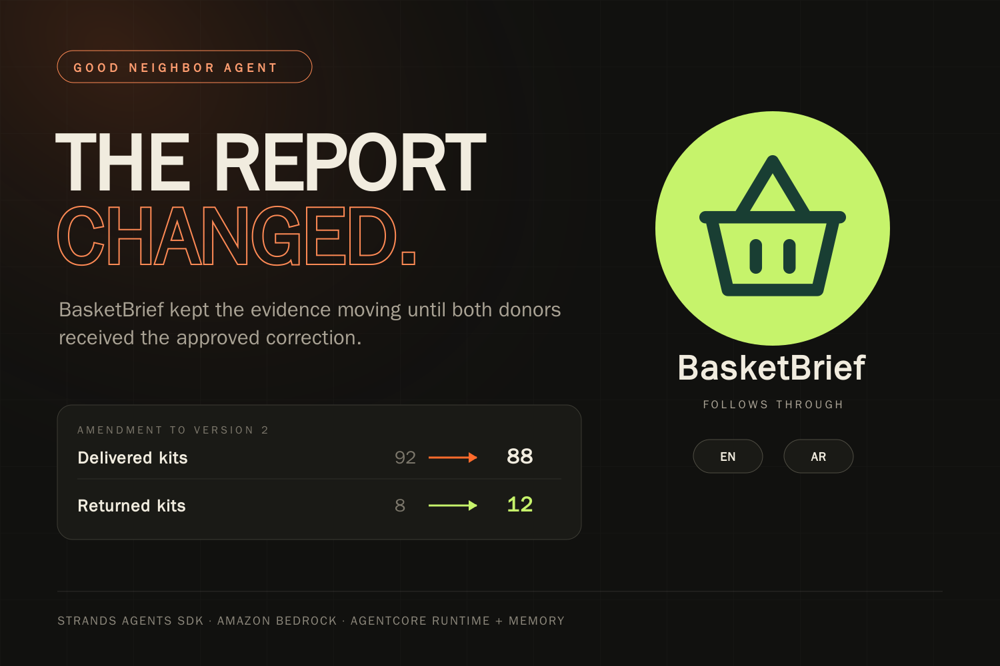

# BasketBrief



**The report was sent. Then the count changed. BasketBrief follows through.**

A volunteer relief coordinator owes two donors a report. Receipts sit with one person, distribution counts with another. BasketBrief reads the sources, asks the responsible contributor for missing evidence, prepares the reports, and delivers the coordinator-approved version to both donor inboxes.

Then a field correction arrives. The agent follows up on the discrepancy, incorporates the answer, shows exactly what changed, and delivers a newly approved amendment. The original reports remain intact. A kit discrepancy never becomes an invented household impact claim.

[Live demonstration](https://basketbrief.mlki.app) · [Agents for Humans](https://agentsforhumans.devpost.com/) · Good Neighbor Agents · MIT

## Try the complete loop

Press **Play the whole story** for a guided simulation using the live Strands agent. Fictional replies and approvals are supplied by the demo controller; model calls, database operations, and inbox deliveries execute live. You can also switch roles and perform each step yourself.

1. Three sources report USD 1,260 spent, of which USD 60 lacks a receipt; 100 kits loaded, 92 delivered, 8 returned. Unique households are unknown.
2. BasketBrief asks **Rana**, the finance contributor, for the missing transport receipt. One answer supports both reports.
3. Rana uploads the sample receipt photograph. Nova Pro transcribes it through AgentCore Runtime. A human can compare the transcript with the original image.
4. **Amal** reviews and approves version 2. Each donor receives an immutable snapshot in English or Arabic.
5. **Sami** corrects delivery to 88. The old approval no longer authorizes the new report. Four kits are unaccounted for; the agent asks Sami to check the delivery and storage records.
6. Sami confirms **12 returned**. The discrepancy closes. Amal reviews the before/after comparison and approves the amendment.
7. Both donors receive the new version with the exact changes. Their original version still says 92 delivered and 8 returned.

The standalone receipt reader also accepts an image you choose. It demonstrates transcription and arithmetic checks, not validation of real-world spending.

## Why an agent helps

The model interprets source messages and chooses how to ask for missing information. Code handles arithmetic, source checks, role permissions, persisted follow-ups, report versions, approvals and inbox delivery. A post-turn check delivers a scoped follow-up if the model left a known gap unasked.

This is one Strands `Agent` with seven tools and a sequential executor on Amazon Bedrock Nova Pro. Report bodies are deterministic English/Arabic templates over stored facts; they are not model-written narratives. The receipt reader runs on **AgentCore Runtime**, with a logged in-process fallback. **AgentCore Memory** provides an advisory vendor history for the configured demo team.

[Architecture](docs/architecture.png) · [Verification and limits](docs/EVALUATION.md)

## Run locally

Python 3.11+:

```bash
git clone https://github.com/NexuChat/basketbrief
cd basketbrief
python3 -m venv .venv
.venv/bin/pip install -e ".[dev]"
.venv/bin/python -m pytest -q
.venv/bin/python scripts/baseline.py
.venv/bin/uvicorn basketbrief.web:app --port 8770
```

Open http://127.0.0.1:8770. Without cloud configuration the app displays **Local test parser · No AI**. Text replies work offline; receipt-image reading requires Bedrock. `python -m basketbrief.demo` also runs the original text-based correction walkthrough without AWS.

For live inference:

```bash
export AWS_PROFILE=your-profile AWS_REGION=us-east-1
export BASKETBRIEF_ENGINE=bedrock
export BASKETBRIEF_MODEL=us.amazon.nova-pro-v1:0
.venv/bin/uvicorn basketbrief.web:app --port 8770
```

The identity needs `bedrock:InvokeModel` and `bedrock:InvokeModelWithResponseStream` for the inference profile and its destination foundation model. Runtime and Memory are optional; their configuration and policies are described under `runtime/` and `basketbrief/vendors.py`. An unattended deployment needs an application identity that remains usable through judging; an interactive AWS login can expire while HTTP health checks still pass.

## What is measured

`scripts/baseline.py` executes the complete **scripted local** flow and counts persisted questions, contributor replies, coordinator approvals and donor deliveries. These are system interactions, not human effort or minutes saved. It includes both contributor replies and both approvals.

We withdrew the earlier “41 human acts → 2” headline after independent review: it counted manual transcription and checking in detail but reduced the agent-assisted side to approval decisions. Repeatable arithmetic did not make that a fair comparison. We now report directly observed behavior and describe human review as necessary.

## Scope and limits

- All teams, donors, receipts and distribution events in the demo are fictional. There is no field pilot, real donor endorsement, or measured hours/money saved.
- One supplies transaction and one transport transaction are supported per distribution. A separate purchase is surfaced for review and cannot silently overwrite an existing expense. This is not a general accounting ledger.
- Source checks recognize supported English/Arabic patterns and require a stated total/currency-associated expense and a number associated with the correct field. Unrecognized phrasing needs clarification. They do not guarantee arbitrary-language understanding or perfect OCR.
- Latin-script receipt fixtures have been tested. Arabic-only wording was unreliable in earlier Nova Pro tests; unsupported text must remain unknown.
- The original image remains available to the coordinator. Matching a model-generated transcription cannot establish that it matches the pixels.
- Delivery means a persisted inbox message inside this application, not external email delivery, a read receipt, or proof that aid reached a household.
- Demonstration role switching intentionally grants the visitor control of fictional participants. Capability checks still separate API roles and workspaces; this is not a production identity/onboarding system.
- Unit tests cover deterministic boundaries. They do not establish resistance to every prompt injection. Live model adversarial results, if measured, are reported separately.

## Layout

`agent.py` — Strands and follow-up loop · `store.py` — evidence, facts, approvals, amendments and delivery · `grounding.py` — constrained source interpretation · `vision.py` — receipt transcription · `vendors.py` — advisory Memory ledger · `web.py` — API and export · `static/` — interface · `tests/` — regressions · `docs/` — submission and evidence.

## Disclosure

Built during this hackathon. Persistence/channel patterns originated in an abandoned entry for the same competition and were reused; domain-specific evidence, reconciliation, vision, approvals and delivery were implemented here. AI coding assistants were used throughout. See [LICENSE](LICENSE).
